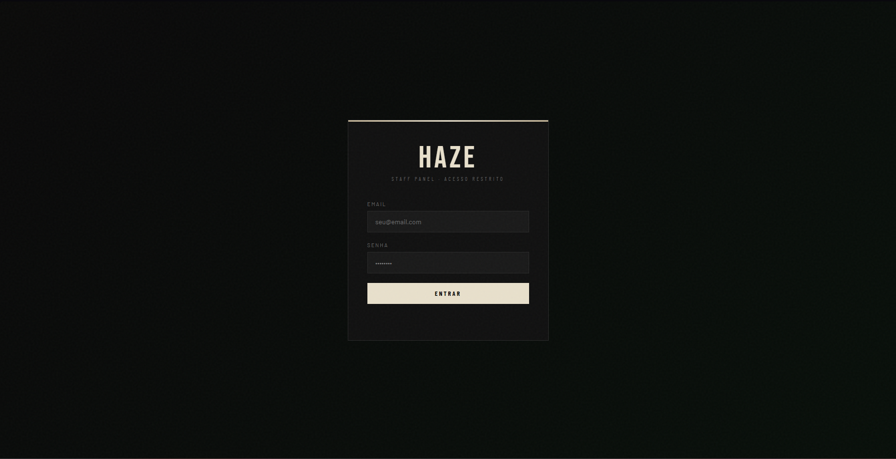
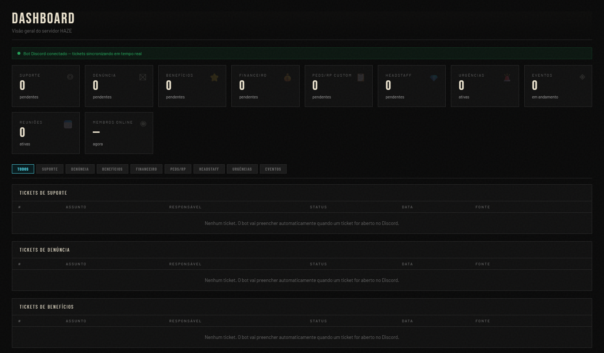
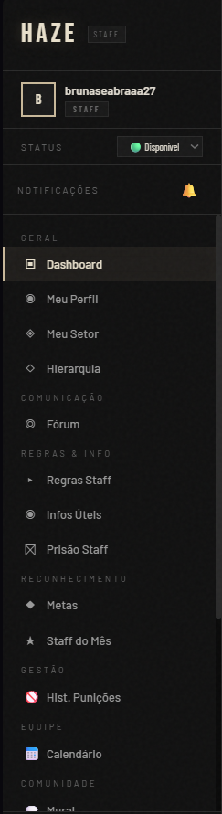

# HAZE Staff Panel

Painel administrativo inspirado em sistemas reais, com foco em organização, usabilidade e estrutura de gestão interna.

## 📌 Sobre o projeto
Este projeto foi desenvolvido com o objetivo de simular um sistema administrativo utilizado para gestão interna de equipes.

O sistema inclui:
- Tela de login
- Navegação com menu lateral
- Organização de usuários por cargos
- Visualização de dados em cards
- Tabelas e áreas de gerenciamento

## 💻 Tecnologias utilizadas
- HTML
- CSS
- JavaScript

## 🎯 Objetivo
O foco principal foi desenvolver uma interface com aparência profissional, priorizando organização visual e experiência do usuário.

## 🚀 Melhorias futuras
- Integração com backend
- Banco de dados
- Sistema de autenticação real
- Responsividade para dispositivos móveis

## 📸 Imagens do projeto

### 🔐 Tela de Login

### 📊 Dashboard

### ⚙️ Área interna

